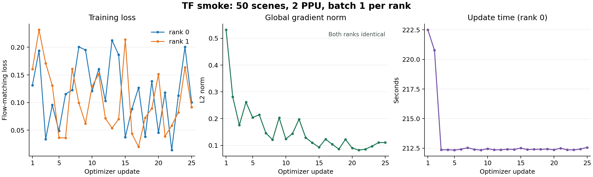
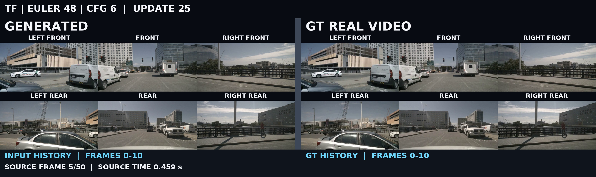
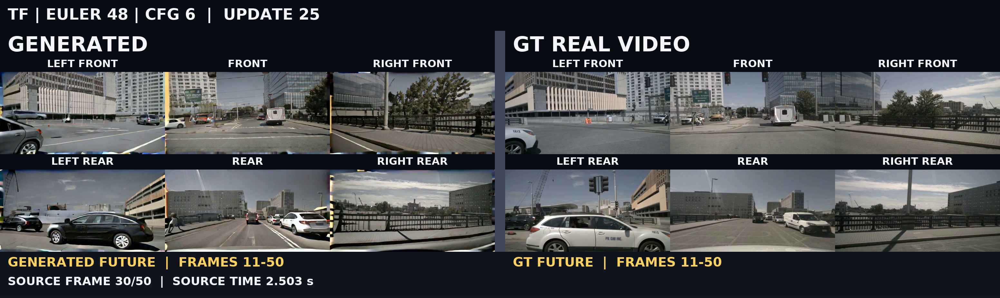
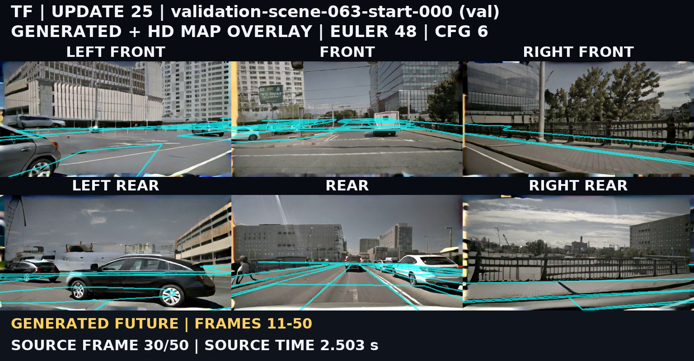
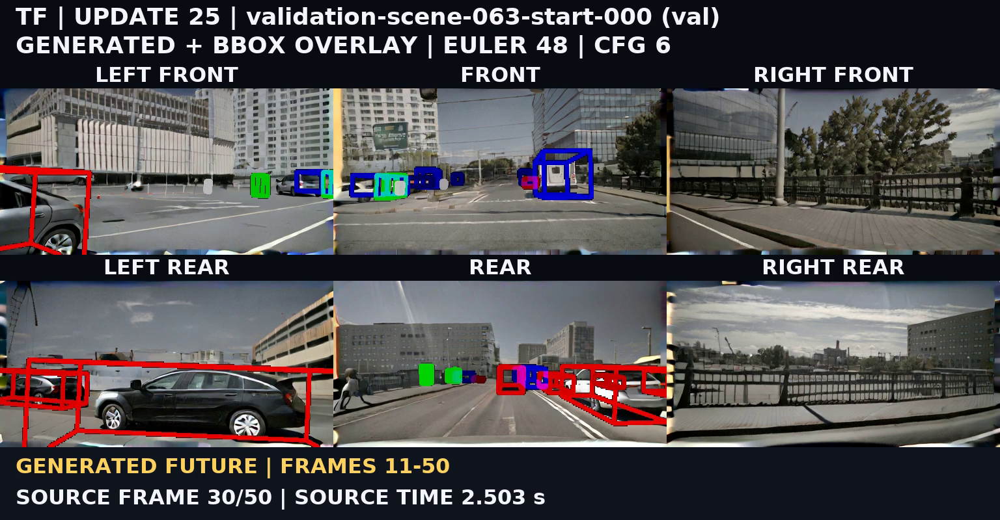

# G0-100 → Causal Forcing 双卡短测

已完成 TF25 → 50 条教师轨迹 → ODE25 → DMD25 outer，以及四阶段保存权重的两条验证推理、十二个 val0 对照视频。DMD 在 outer 10 保存后恢复，累计 5 次 student、25 次 fake 更新。

[W&B 四阶段视频 Report](https://wandb.ai/yuelengqianshan4-wuhan-university/horizondrive-reproduction/reports/G0-→-TF-→-ODE-→-DMD：六视角阶段对照--VmlldzoxODAyNDc1MA==)

## 训练与恢复

| 阶段 | 每 rank 更新数 | 数据覆盖 | 末次 loss（rank 0 / 1） | 实际 W&B run |
|---|---|---|---|---|
| TF | 25 main | 50 条、无重复 | 0.100485 / 0.0917928 | [hd-g0s100-cf-n50_tf25-ppu2_b1-r02](https://wandb.ai/yuelengqianshan4-wuhan-university/horizondrive-reproduction/runs/hdcf50tf25r02)；cf,smoke,train |
| ODE | 25 main | 50 条、无重复 | 0.0475862 / 0.0674774 | [hd-g0s100_tf25-cf-n50_ode25-ppu2_b1-r02](https://wandb.ai/yuelengqianshan4-wuhan-university/horizondrive-reproduction/runs/hdcf50ode25r02)；cf,init,smoke |
| DMD | 5 student / 25 fake | 50 条、无重复 | student 0.344949 / 0.525144；fake 0.049621 / 0.0389252 | [hd-g0s100_tf25_ode25-cf-n50_oi25-ppu2_b1-r02](https://wandb.ai/yuelengqianshan4-wuhan-university/horizondrive-reproduction/runs/hdcf50dmd25r02)；cf,distill,smoke |

各阶段两 rank 均记录 FSDP2/DTensor；更新编号完整覆盖 1–25，指标均有限，逐步全局梯度范数一致。DMD 两 rank 均从 step=10、batch_in_epoch=10 恢复，结束时 epoch=1、batch_in_epoch=0。

实际权重变化在 CPU 上仅读取 `head.head.weight` 核对；源、目标张量均有限。

| 阶段转换 | 变化元素 / 总元素 | 最大绝对差 |
|---|---:|---:|
| G0 → TF | 98,302 / 98,304 | 5.09527e-05 |
| TF → ODE | 98,301 / 98,304 | 5.03212e-05 |
| ODE → DMD | 98,300 / 98,304 | 1.55019e-05 |

## 耗时与显存

组件统计取 rank 0 原始记录，单位秒；DMD student 组件只计入 optimizer 计数实际增加的 5 个 outer。update包含组件耗时；各组件的中位数不能直接相加作为端到端时间。

| 阶段 | 组件 | 次数 | 累计秒 | 中位秒 |
|---|---|---:|---:|---:|
| TF | data | 25 | 0.995 | 0.000 |
| TF | update | 25 | 5328.808 | 212.406 |
| TF | forward | 25 | 1108.103 | 44.204 |
| TF | backward | 25 | 4197.427 | 167.853 |
| TF | optimizer | 25 | 2.923 | 0.043 |
| ODE | data | 25 | 1.071 | 0.000 |
| ODE | update | 25 | 5283.256 | 210.504 |
| ODE | forward | 25 | 1094.266 | 43.640 |
| ODE | backward | 25 | 4168.508 | 166.702 |
| ODE | optimizer | 25 | 2.952 | 0.043 |
| DMD | data | 25 | 9.049 | 0.000 |
| DMD | update | 25 | 9488.306 | 331.750 |
| DMD | generator_forward | 5 | 384.822 | 64.058 |
| DMD | generator_scores | 5 | 741.074 | 148.224 |
| DMD | generator_backward | 5 | 359.187 | 71.393 |
| DMD | generator_optimizer | 5 | 1.951 | 0.052 |
| DMD | critic_rollout | 25 | 1827.713 | 79.124 |
| DMD | critic_forward | 25 | 1235.666 | 49.409 |
| DMD | critic_backward | 25 | 4858.030 | 194.317 |
| DMD | critic_optimizer | 25 | 1.302 | 0.048 |

| 阶段 | 命令耗时秒 | checkpoint 调用累计秒（rank 0） | CPU 导出秒 | 峰值 allocated GiB（r0/r1） | 峰值 reserved GiB（r0/r1） |
|---|---:|---:|---:|---|---|
| TF | 未单独记录 | 未记录 | 15.359 | 82.315 / 82.313 | 92.676 / 92.674 |
| ODE | 5349.719 | 13.802 | 20.122 | 82.236 / 82.234 | 92.598 / 92.594 |
| DMD | 9748.357 | 110.736 | 19.767 | 74.725 / 74.721 | 93.188 / 93.184 |

50 条轨迹生成总耗时 **106142.992 秒**，两 rank 各写入 25 条；48 步 Euler、shift=5、CFG=6。每条轨迹保存四个中间状态、教师端点及对应GT。

## 保存权重推理

四阶段各两个验证样本均记录 finite=true、history_exact=true；展示固定验证样本 val0（scene-063，起始帧0）。

| 阶段 | 采样 | 两 rank 推理秒 | 解码秒 | 渲染秒 | 命令总秒 | 视频 |
|---|---|---|---:|---:|---:|---|
| G0 | EULER 48 / CFG 6 | 4744.305 / 4746.473 | 14.418 | 17.986 | 4816.290 | [GT](videos/g0/gt-comparison.mp4) · [MAP](videos/g0/map-overlay.mp4) · [BBOX](videos/g0/bbox-overlay.mp4) |
| TF | EULER 48 / CFG 6 | 1867.502 / 1869.226 | 14.212 | 17.620 | 1934.889 | [GT](videos/tf/gt-comparison.mp4) · [MAP](videos/tf/map-overlay.mp4) · [BBOX](videos/tf/bbox-overlay.mp4) |
| ODE | CM 4 / CFG 1 | 100.470 / 102.342 | 12.529 | 18.878 | 169.069 | [GT](videos/ode/gt-comparison.mp4) · [MAP](videos/ode/map-overlay.mp4) · [BBOX](videos/ode/bbox-overlay.mp4) |
| DMD | CM 4 / CFG 1 | 100.487 / 102.367 | 12.293 | 18.556 | 166.272 | [GT](videos/dmd/gt-comparison.mp4) · [MAP](videos/dmd/map-overlay.mp4) · [BBOX](videos/dmd/bbox-overlay.mp4) |

每阶段源帧 51，展示 291 帧、24 fps、12.125 秒。两 rank 并行，推理耗时不相加。val0在各阶段固定seed=42；历史源帧0–10，生成源帧11–50。

TF 历史源帧 5 的内容、相机位置和色调与 GT 基本对应，细节略软。history_exact 表示 latent 逐值保留；有损 VAE 重建不要求与 GT 像素逐值相同。

TF 未来源帧 30 中道路与建筑可辨认，但存在边缘彩色条带、局部几何扭曲及车辆外观、位置差异。原始 Map/BBox 按同帧同视角叠加，部分控制与生成内容未精确贴合。

## 训练配置

数据为nuScenes的50个训练场景与2个独立验证场景，每个场景取起始51帧；本页各阶段展示同一条验证样本。六视角各256×512，历史11帧、未来40帧、每块10帧、历史窗口11。条件为文本、HD Map、BBox和ego action（x/y/yaw）。

DSW双PPU-ZW810E，每卡batch=1，全局batch=2，无梯度累积；BF16计算、FP32归约、FSDP2、activation checkpointing，seed=42、workers=2。训练和正式配置使用同一代码路径。

| 阶段 | 更新目标 | AdamW学习率 | betas | weight decay / grad clip |
|---|---|---|---|---|
| TF | 25次 | 2e-6 | (0, 0.999) | 0.01 / 10 |
| ODE初始化 | 25次 | 2e-6 | (0.9, 0.999) | 0.01 / 10 |
| DMD student | 实际5次 | 2e-6 | (0, 0.999) | 0.01 / 10 |
| DMD fake | 25次 | 4e-7 | (0, 0.999) | 0.01 / 10 |

DMD每5个outer更新一次学生，实际更新发生在outer1/6/11/16/21；表中student末次loss对应outer21。其余outer仅更新fake。学生采用四步去噪，raw时间点1000/750/500/250，经shift=5得到sigma 1/0.9375/0.8333/0.625。教师轨迹采用48步Euler、shift=5、标准CFG=6；DMD real-score采用cond + 3×(cond−uncond)，等效标准CFG=4。EMA decay=0.99，从outer200启用，本轮导出和推理使用raw学生权重。

## 如何看视频

- G0-100：观察蒸馏之前的六视角基准生成结果。
- TF-25：观察因果化、使用真实历史训练之后的生成结果。
- ODE-25：观察四步采样初始化后的生成效果。
- DMD outer-25：观察学生5次更新后的生成效果及控制一致性。

生成＋GT采用左右对照；Map以亮青色、alpha=0.7叠加；BBox保留原框线颜色。六视角上排左前/前/右前，下排左后/后/右后；每个拼接视频内部按帧同步。亮青色仅用于展示，训练Map和编码条件保持原样。

## 扩展与限制

本轮验证双卡训练、保存、断点恢复、推理和展示链路，不代表模型收敛，也不构成算法优劣或等质量加速结论。G0/TF采用48步CFG6，ODE/DMD采用4步CFG1，采样设置不同。有限输出和历史latent一致不能替代视频质量评价。上述图像观察仅覆盖TF示例。

正式扩展复用训练入口及TF/ODE/DMD配置，分别调整torchrun卡数与节点、每卡batch、数据范围、更新上限、epoch和num_workers；新实验使用独立输出目录。原TF命令的退出码和checkpoint耗时未单独记录，完成依据为完整rank记录、checkpoint、成功导出与W&B finished；其余阶段训练、导出、推理及发布退出码均为0。

参考：[minWM官方实现](https://github.com/shengshu-ai/minWM) · [Causal Forcing论文](https://arxiv.org/abs/2602.02214) · [nuScenes](https://www.nuscenes.org/nuscenes)。
